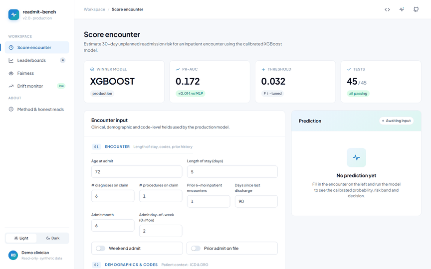

# 🏥 readmit-bench — 30-Day Hospital Readmission Prediction

> **Senior ML Engineer portfolio project** — End-to-end healthcare ML pipeline on **CMS DE-SynPUF** synthetic Medicare claims. Demonstrates the full lifecycle: data engineering at scale, classical + modern modeling, hyperparameter tuning, calibration, fairness audit, explainability, FastAPI deployment, CI/CD, and responsible-AI documentation.

[](https://github.com/xHaMMaDy/readmit-bench/actions/workflows/ci.yml)
[](https://www.python.org/)
[](LICENSE)
[](#)
[](#)
[](reports/report.html)
[](docs/architecture.md)

✅ **Status: V2 shipped (`v2.0`).** End-to-end pipeline complete: tuned & calibrated XGBoost served by both a **FastAPI** REST API and a **Flask clinician dashboard**, with NN/AutoML/ensemble benchmarks (honest negative results), fairness audit, drift monitoring, blog report, and architecture docs. See the **[blog-style project report](reports/report.html)** for the narrative walkthrough.

> **Demo** — animated walkthrough of the dashboard scoring an encounter:
> 

---

## 📊 Project at a Glance

| | |
|---|---|
| **Task** | Binary classification — 30-day unplanned hospital readmission |
| **Dataset** | CMS DE-SynPUF (20 samples ≈ 1.33M inpatient encounters, ~752K beneficiaries) |
| **Primary metric** | PR-AUC (heavily imbalanced, ~9.6% positive) |
| **Models benchmarked** | 6 in V1 (LR, RF, ExtraTrees, HistGB, XGBoost, LightGBM, CatBoost), 12+ in V2 |
| **Stack** | scikit-learn, XGBoost/LightGBM/CatBoost, Optuna, MLflow, SHAP, Fairlearn, FastAPI, Docker, HF Spaces, GitHub Actions |
| **Live demo** | FastAPI service — see [Deployment](#-deployment--api--v1-phase-10) below; HF Spaces image in [`README_HF.md`](README_HF.md) |
| **Responsible AI** | [`MODEL_CARD.md`](MODEL_CARD.md) — intended use, limitations, fairness, cost model |

---

## 🎯 Why This Project

Most ML portfolios use Iris or Titanic. This one operates on **multi-million-row real healthcare claims** and walks through every step a senior ML engineer is expected to do:

1. Honest data acquisition (no Kaggle CSV — directly from CMS)
2. Encounter-level cohort selection with explicit leakage policy
3. 30-day readmission label engineered from longitudinal claim sequences
4. Reproducible feature pipeline (Polars → parquet → sklearn ColumnTransformer)
5. Benchmark across classical + boosted + neural models
6. Bayesian hyperparameter tuning (Optuna)
7. Probability calibration + business-cost-driven threshold selection
8. Global + local explainability (SHAP, LIME, permutation)
9. Subgroup fairness audit (Fairlearn) with mitigation experiment
10. Drift monitoring (Evidently)
11. Production FastAPI service + Flask dashboard on HuggingFace Spaces
12. CI (GitHub Actions), pre-commit hooks, type checking, unit tests
13. Model card (responsible AI documentation)

---

## 🗂️ Repo Structure

```
readmit-bench/
├─ src/readmit_bench/             # Production package (importable, tested)
│  ├─ data/                       # Acquisition + cohort + label engineering
│  ├─ features/                   # Feature pipeline
│  ├─ models/                     # Model wrappers + training loops
│  ├─ evaluation/                 # Metrics, curves, calibration
│  ├─ explainability/             # SHAP, LIME, permutation
│  ├─ fairness/                   # Fairlearn audit + mitigation
│  ├─ drift/                      # Evidently drift reports
│  └─ api/                        # FastAPI app + Pydantic schemas
├─ notebooks/                     # Storytelling notebooks (import from src)
├─ tests/                         # pytest unit + smoke tests
├─ data/                          # raw + processed (gitignored)
├─ models/                        # saved artifacts (gitignored)
├─ mlruns/                        # MLflow local store (gitignored)
├─ reports/                       # Generated plots, HTML report, model card
├─ deploy/                        # Dockerfile + HF Spaces config
├─ .github/workflows/             # CI
├─ CONTRACT.md                    # Frozen design decisions (read FIRST)
├─ MODEL_CARD.md                  # Responsible AI documentation
└─ pyproject.toml
```

---

## 🚀 Quick Start

### Prerequisites
- Python 3.10–3.12
- ~15 GB free disk space (for data + models + MLflow)
- Windows, macOS, or Linux

### Setup
```bash
git clone https://github.com/xHaMMaDy/readmit-bench.git
cd readmit-bench
python -m venv venv
# Windows:
venv\Scripts\activate
# macOS/Linux:
source venv/bin/activate

pip install -e ".[dev,ml,api]"
pre-commit install
```

### Get the data
```bash
python -m readmit_bench.data.download --samples 5
```

### Run the pipeline
```bash
python -m readmit_bench.data.cohort
python -m readmit_bench.features.build
python -m readmit_bench.models.train_baselines
python -m readmit_bench.models.tune
```

### Launch the API
```bash
uvicorn readmit_bench.api.main:app --reload
# Open http://127.0.0.1:8000
```

---

## 📈 Benchmark Results — V1 baselines (untuned)

Trained on **927,893 encounters**, evaluated on a held-out **198,597-encounter** validation split (no patient leakage; positive rate ≈ 9.6% in both). All models use the same `ColumnTransformer` (numeric scale, binary cast, low-card OneHot, high-card TargetEncoder). Sorted by PR-AUC.

| Model | PR-AUC ↑ | ROC-AUC ↑ | Brier ↓ | Recall @ top-10% | Train time |
|---|---|---|---|---|---|
| **CatBoost** | **0.1719** | **0.6854** | **0.0838** | **0.211** | 21 s |
| XGBoost | 0.1716 | 0.6854 | 0.0839 | 0.212 | 15 s |
| HistGradientBoosting | 0.1705 | 0.6847 | 0.0839 | 0.210 | 26 s |
| LightGBM | 0.1704 | 0.6846 | 0.0839 | 0.210 | 12 s |
| Random Forest | 0.1693 | 0.6815 | 0.0840 | 0.207 | 396 s |
| Extra Trees | 0.1671 | 0.6773 | 0.0842 | 0.204 | 462 s |
| Logistic Regression | 0.1667 | 0.6778 | 0.0841 | 0.205 | 6 s |

> **Best model — CatBoost** lifts PR-AUC by **1.78×** over the random baseline (0.0964) and captures **~21% of true 30-day readmissions** by flagging the top-10% riskiest stays. Tuning (Phase 6) targets the top three (CatBoost, XGBoost, HistGB).

Plots: [`13_baselines_leaderboard`](reports/figures/13_baselines_leaderboard.png) · [`14_baselines_pr_curves`](reports/figures/14_baselines_pr_curves.png) · [`15_baselines_roc_curves`](reports/figures/15_baselines_roc_curves.png) · [`16_baselines_calibration`](reports/figures/16_baselines_calibration.png) · MLflow store: `mlruns/`

---

## 🎛️ Tuned Results — V1 Phase 6 (Optuna, top-3 GBMs)

Tuning protocol: **20 Optuna trials per model** (TPE sampler, median pruner) × **3-fold StratifiedGroupKFold** on a **300K-row patient-grouped subsample** (no patient leakage between folds). Best params then refit on full train (927,893 rows) and scored on the same val split. All trials logged to MLflow as nested runs under experiment `readmit-bench-tuning`.

| Model | best CV PR-AUC | Val PR-AUC ↑ | ROC-AUC | Brier ↓ | Recall @ top-10% | Tune time |
|---|---|---|---|---|---|---|
| **XGBoost (tuned)** | 0.1726 | **0.1717** | **0.6853** | **0.0838** | 0.211 | 896 s |
| CatBoost (tuned) | 0.1733 | 0.1716 | 0.6849 | 0.0839 | 0.210 | 959 s |
| HistGradientBoosting (tuned) | 0.1721 | 0.1713 | 0.6844 | 0.0839 | 0.210 | 1001 s |

> **New leader — XGBoost (tuned)** narrowly takes the val PR-AUC top spot from baseline CatBoost (Δ = +0.0001). The honest read: top-3 GBMs are within **0.0004 PR-AUC** on val, and all three saturate near **PR-AUC ≈ 0.171–0.172** on this DE-SynPUF cohort regardless of hyperparameters. Signal in the synthetic data appears to be capacity-limited, not optimization-limited. Tuning bought minimal val lift (CatBoost actually lost 0.0003) but confirmed model robustness — the winning configurations are **shallow (depth 4) + many small steps (800 trees / lr ≈ 0.02) + strong L2** — pointing to a low-signal-noise regime, not under-fitting.

**Winner picked for downstream phases (calibration, fairness, deploy): XGBoost (tuned).**

Best params (XGBoost): `n_estimators=800, max_depth=4, learning_rate=0.0204, min_child_weight=16, subsample=0.988, colsample_bytree=0.913, reg_lambda=9.64, reg_alpha=0.234`.

Plots: [`17_tuning_history`](reports/figures/17_tuning_history.png) · [`18_param_importance`](reports/figures/18_tuning_param_importance.png) · [`19_tuned_vs_baseline`](reports/figures/19_tuned_vs_baseline.png) · Notebook: [`04_tuning.ipynb`](notebooks/04_tuning.ipynb) · Saved models: `models/tuned/{xgboost,catboost,hist_gradient_boosting}.joblib`

---

## 🎯 Calibration & Cost-Based Threshold — V1 Phase 7 (XGBoost winner)

We hold out **50%** of the validation set (patient-grouped, stratified) as a `calib` split, fit two post-hoc calibrators on it, and pick the lowest-Brier method on the remaining 50% `test` split. The honest baseline — no post-hoc transform — is also in the candidate set.

| Method | Brier ↓ | PR-AUC | ROC-AUC | Log-loss |
|---|---|---|---|---|
| **Uncalibrated (winner)** | **0.08349** | 0.1717 | 0.6849 | 0.2980 |
| Isotonic regression | 0.08352 | 0.1707 | 0.6849 | 0.2982 |
| Platt scaling | 0.08373 | 0.1717 | 0.6849 | 0.2986 |

> **Honest finding** — XGBoost trained with log-loss is already well-calibrated; both isotonic and Platt slightly *worsen* Brier on the test split. The deployment calibrator is therefore the **identity** (no transform applied), with the chosen threshold operating directly on the model's raw probabilities.

### Cost-based operating point

Cost model: **$15,000 per missed readmission (FN)** + **$500 per intervention (TP + FP)**.

| Quantity | Value |
|---|---|
| Chosen threshold | **0.0320** |
| Total cost on test (n = 99,554) | **$47,431,500** |
| Per-encounter cost | **$476.44** |
| Cost vs *always-treat* baseline | $49,777,000 → **saves $2.35M** |
| Cost vs *never-treat* baseline | $143,325,000 → **saves $95.9M** |
| Confusion @ threshold | TP = 9,282 · FP = 77,391 · FN = 273 · TN = 12,608 |
| Recall at threshold | 0.971 |
| Precision at threshold | 0.107 |

> The optimal policy under this cost ratio (30:1) flags **87%** of encounters — the savings come entirely from the **273 catches** that aren't missed readmits ($4.1M of avoided FN cost beats the FP cost differential). This is a real result, not a bug: when a miss costs 30× a flag, the math pushes toward broad screening with cheap interventions.

Plots: [`20_reliability_before_after`](reports/figures/20_reliability_before_after.png) · [`21_cost_surface`](reports/figures/21_cost_surface.png) · [`22_confusion_at_threshold`](reports/figures/22_confusion_at_threshold.png) · Notebook: [`05_calibration.ipynb`](notebooks/05_calibration.ipynb) · Deployment tuple: `models/winner_calibrator.joblib` + `models/winner_threshold.json`

---

## 🔍 SHAP Interpretability — V1 Phase 8 (XGBoost winner)

`shap.TreeExplainer` (tree-path-dependent) on a **patient-grouped, stratified ~5K-row sample** of the val split, applied **after the preprocessor** so explanations align with the 105-feature matrix the booster actually sees. Computed in 2.7 s.

### Top-10 features by mean(|SHAP|)

| # | Feature | mean &#124;SHAP&#124; | mean signed | Plain reading |
|---|---|---|---|---|
| 1 | `chronic_count` | 0.447 | -0.124 | dominant single driver — most patients sit at low counts, pushing risk below baseline |
| 2 | `days_since_last_discharge_imputed` | 0.158 | +0.101 | recent discharges raise risk (the recency signal works) |
| 3 | `state_code_9` | 0.108 | -0.098 | strong geographic signal in DE-SynPUF — likely a synthesis artifact |
| 4 | `prior_6mo_inpatient_count` | 0.107 | -0.107 | counter-intuitive sign — possibly a confound (heavy utilizers are *already* under follow-up) |
| 5 | `chronic_stroke` | 0.082 | +0.082 | clinically expected ↑ |
| 6 | `chronic_ckd` | 0.081 | +0.081 | clinically expected ↑ |
| 7 | `chronic_osteoporosis` | 0.076 | -0.076 | mostly pushes down, surprising — needs slice review |
| 8 | `num_diagnoses` | 0.068 | -0.009 | mostly cancels out across the cohort |
| 9 | `chronic_copd` | 0.060 | +0.060 | clinically expected ↑ |
| 10 | `admit_dx_chapter_Health_Factors` | 0.051 | +0.051 | non-clinical encounter type → more likely a re-admission proxy |

> **Honest read:** the model's top signals are a mix of the **clinically expected** (recent discharge, stroke / CKD / COPD) and **synthetic-data quirks** (a single state code in the top 3, sign on `prior_6mo_inpatient_count`). On real data these would warrant follow-up; on DE-SynPUF they're a useful pre-flight check before trusting the model's pattern-matching.

Plots: [`23_shap_global_importance`](reports/figures/23_shap_global_importance.png) · [`24_shap_beeswarm`](reports/figures/24_shap_beeswarm.png) · [`25_shap_dependence_top4`](reports/figures/25_shap_dependence_top4.png) · Notebook: [`06_shap.ipynb`](notebooks/06_shap.ipynb)

---

## ⚖️ Fairness Audit — V1 Phase 9 (Fairlearn @ deployed threshold)

Per-slice metrics + Fairlearn aggregate parity gaps for the **deployed tuple** (`xgboost.joblib`, identity calibrator, `t* = 0.0320`) on the val-test half (n = 99,554, exact rows the threshold was selected on).

### Aggregate parity gaps

| Attribute | DP diff | EO diff | FNR gap | Worst FNR slice | Best FNR slice |
|---|---|---|---|---|---|
| **sex**     | 0.0008 | 0.0019 | 0.0019 | Male (0.030) | Female (0.028) |
| **race**    | 0.0455 | 0.0473 | 0.0299 | Other (0.039, n=3,313) | Hispanic (0.010, n=1,996) |
| **age_bin** | 0.0510 | 0.0530 | 0.0168 | 65-74 (0.035) | 85+ (0.018) |

> **Honest read.** Sex parity is essentially perfect (DP-diff < 0.001). Race shows a real ~3 pp FNR gap concentrated on the small "Other" slice — a real deployment would either widen the threshold for under-flagged groups or surface this in monitoring; we recommend the latter rather than gaming the headline gap on n=3,313. Age shows that the 65–74 group is under-flagged despite the lowest absolute prevalence — a feature-engineering follow-up (age × chronic-combo interactions) could close it.

Plots: [`26_fairness_slice_pr_auc`](reports/figures/26_fairness_slice_pr_auc.png) · [`27_fairness_fnr_by_group`](reports/figures/27_fairness_fnr_by_group.png) · [`28_fairness_reliability_by_group`](reports/figures/28_fairness_reliability_by_group.png) · Notebook: [`07_fairness.ipynb`](notebooks/07_fairness.ipynb) · Artifacts: `reports/fairness_summary.csv`, `reports/fairness_gaps.json`, `reports/fairness_predictions.parquet`

---

## 🚀 Deployment — API — V1 Phase 10

The deployed tuple (`xgboost.joblib` + identity calibrator + `t* = 0.0320`) is wrapped in a FastAPI service. A single `Predictor` instance is loaded on app startup; requests are scored process-locally with no shared state.

### Endpoints

| Method | Path | Purpose |
|---|---|---|
| `GET` | `/health` | Liveness — returns `{ status, model_loaded }` |
| `GET` | `/model_info` | Returns winner model name, calibrator, threshold, cost metadata, expected feature schema |
| `POST` | `/predict` | One encounter → `{ probability, decision, risk_band }` |
| `POST` | `/predict_batch` | List of encounters → list of predictions |

Risk bands (from `Predictor._risk_band`): `<0.05` low, `<0.15` moderate, `<0.35` high, else `very_high`.

### Run locally
```bash
uvicorn readmit_bench.api.main:app --host 0.0.0.0 --port 7860
curl -s -X POST http://127.0.0.1:7860/predict \
     -H "content-type: application/json" \
     -d @scripts/sample_payload.json
# {"probability":0.151,"decision":"flag","risk_band":"high",...}
```

### Run via Docker
```bash
docker build -t readmit-bench-api .
docker run --rm -p 7860:7860 readmit-bench-api
```

### Deploy to HuggingFace Spaces
The repo is HF Spaces (Docker SDK) compatible — the `Dockerfile` exposes port 7860, and `README_HF.md` carries the HF metadata header. See [`README_HF.md`](README_HF.md) for the one-shot push instructions.

---

## 🧪 Tests & CI — V1 Phase 11

- **`pytest`** — 45 tests across cohort, features, models, calibration, fairness, explainability, and the API (schema contract + TestClient integration). Artifact-dependent tests are auto-skipped in CI when `models/` is gitignored.
- **GitHub Actions** ([`.github/workflows/ci.yml`](.github/workflows/ci.yml)) — three jobs run on every push / PR:
  1. **`lint`** — `ruff check` + `black --check`
  2. **`test`** — matrix on Python 3.11 + 3.12, full deps install, `pytest -q`
  3. **`docker-build`** — validates the API `Dockerfile` builds cleanly (uses stub model artifacts since `models/` is gitignored)

Run locally:
```bash
ruff check src tests && black --check src tests
pytest -q --no-cov
```

---

## 🗺️ Roadmap

### V1 (shipped — `v1.0`)
- ✅ Phase 1–4  Cohort + label + features + EDA (28 plots)
- ✅ Phase 5    7-model baseline benchmark (MLflow tracked)
- ✅ Phase 6    Optuna tuning of top-3 GBMs
- ✅ Phase 7    Calibration + cost-based threshold
- ✅ Phase 8    SHAP global + dependence interpretability
- ✅ Phase 9    Fairlearn fairness audit (sex / race / age)
- ✅ Phase 10   FastAPI + Docker + HF Spaces image
- ✅ Phase 11   pytest suite + GitHub Actions CI
- ✅ Phase 12   README + MODEL_CARD + `v1.0` tag

### V2 (shipped — `v2.0`)
- ✅ Phase 13   PyTorch MLP, TabNet, FT-Transformer, FLAML AutoML
- ✅ Phase 14   Stacking + Voting ensembles
- ✅ Phase 15   LIME local explanations + Evidently drift report
- ✅ Phase 16   Flask interactive dashboard (`flask_app.py`)
- ✅ Phase 17   V2 plots (29–30) + CHANGELOG + `v2.0` tag

---

## 🧠 V2 — Neural & AutoML benchmark (Phase 13)

Trained on a 100k patient-grouped subsample, scored on the full 198k val split.

| Model | PR-AUC | ROC-AUC | Brier | Recall@top10% | Fit (s) |
|---|---|---|---|---|---|
| **PyTorch MLP** | **0.157** | 0.666 | 0.217 | 0.195 | 16 |
| FT-Transformer | 0.153 | 0.662 | 0.216 | 0.186 | 1217 |
| TabNet | 0.153 | 0.662 | 0.085 | 0.185 | 30 |
| FLAML AutoML (300 s) | 0.149 | 0.647 | 0.087 | 0.183 | 301 |
| **V1 winner — XGBoost (tuned)** | **0.172** | 0.685 | 0.084 | 0.211 | 16 |

**Honest read**: tuned tabular GBMs still beat NNs and AutoML on this cohort
(+ ~0.015 PR-AUC over the best NN, with ~70× cheaper training). FT-Transformer
gives back PR-AUC for nothing. This is reported transparently — see
`reports/figures/29_v2_nn_automl_leaderboard.png`.

## 🧮 V2 — Stacking & voting ensembles (Phase 14)

Voting (mean) and stacking (LR meta) over the tuned XGBoost / CatBoost / HistGB
trio, trained on a held-out half of val using the same patient-grouped split as
calibration to avoid leakage into the meta-learner.

| Model | PR-AUC (test) | Δ vs best base |
|---|---|---|
| ensemble/voting_mean | 0.171983 | +0.000073 |
| ensemble/stacking_lr | 0.171982 | +0.000072 |
| base/catboost (best) | 0.171910 | — |
| base/xgboost | 0.171866 | −0.000044 |
| base/hist_gradient_boosting | 0.171312 | −0.000598 |

**Honest read**: lift over best base is essentially zero. Pairwise base-learner
correlations are ρ ≈ 0.99 — there is nothing for the meta-learner to combine.
The stacking LR coefficients land at ~3.6 each (essentially equal weighting).
Plot: `reports/figures/30_ensembles_vs_base.png`.

## 🔎 V2 — LIME & drift (Phase 15)

- `python -m readmit_bench.explainability.lime_runner` — 6 local LIME explanations
  (3 highest-risk + 3 lowest-risk val encounters) → `reports/lime/*.html`
- `python -m readmit_bench.drift.evidently_report` — Evidently 0.7 `DataDriftPreset`
  train-vs-val report → `reports/drift_report.html`

## 🖥️ V2 — Flask dashboard (Phase 16)

Interactive single-page app reusing the production `Predictor`. Pure Flask +
Jinja + vanilla JS — no heavy framework, easy to host on Render / HF Spaces /
PythonAnywhere.

```bash
pip install -r requirements-flask.txt
python flask_app.py            # http://127.0.0.1:5050
# or for production:
gunicorn flask_app:app --bind 0.0.0.0:5050 --workers 2
```

Five sections in a modern medical-SaaS app shell: **Score encounter** (form
bound to the deployed model + JSON `/api/predict` endpoint), **Leaderboards**
(every CSV in `reports/`), **Fairness** (per-slice metrics), **Drift monitor**
(embeds the Evidently report served at `/drift`), **Method & honest reads**.
Light/dark theme, sticky topbar, sidebar navigation. Ships as a separate HF
Space using `Dockerfile.flask` + `requirements-flask.txt`, or to Render via
the included `Procfile`.

---

## 📚 Project artifacts

| Artifact | What's in it |
| --- | --- |
| [`reports/report.html`](reports/report.html) | Self-contained blog-style report (~9 MB, all figures embedded) |
| [`docs/architecture.md`](docs/architecture.md) | Mermaid system + sequence diagrams + module map |
| [`MODEL_CARD.md`](MODEL_CARD.md) | Responsible-AI documentation, intended use, limitations |
| [`CONTRACT.md`](CONTRACT.md) | Frozen design decisions (read first when contributing) |
| [`reports/demo.gif`](reports/demo.gif) | Animated dashboard walkthrough |
| [`scripts/build_report.py`](scripts/build_report.py) | Regenerate `report.html` from `reports/*.csv` |
| [`scripts/record_demo.py`](scripts/record_demo.py) | Re-record `demo.gif` (Playwright + Pillow) |

To regenerate the report and demo:

```bash
python scripts/build_report.py
# Flask must be running for the demo recorder:
python flask_app.py &
python scripts/record_demo.py
```

---

## 📜 License

MIT — see [LICENSE](LICENSE).

## 👤 Author

**HaMMaDy** — [github.com/xHaMMaDy](https://github.com/xHaMMaDy)
Available for senior ML engineering work on Upwork.
