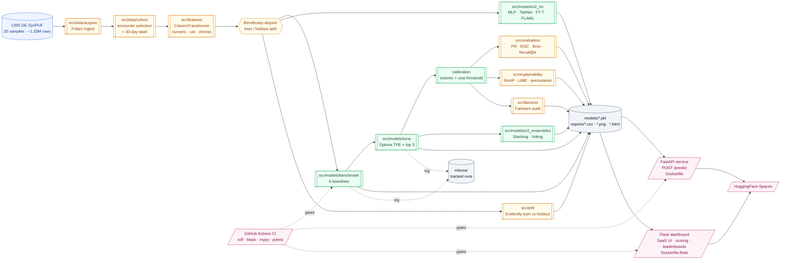
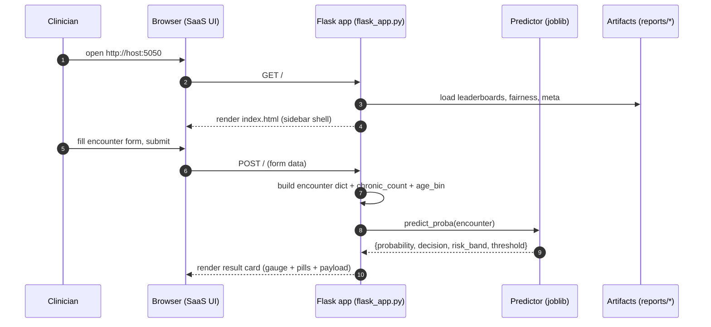

# readmit-bench — Architecture

End-to-end system architecture for the 30-day readmission risk pipeline.

## High-level flow

## Runtime topology — Flask dashboard

## Module map

| Layer            | Module                              | Responsibility                                             |
| ---------------- | ----------------------------------- | ---------------------------------------------------------- |
| Data             | `src/readmit_bench/data/`           | CMS download, cohort selection, label engineering          |
| Features         | `src/readmit_bench/features/`       | ColumnTransformer, frequency encoders                      |
| Models           | `src/readmit_bench/models/`         | Benchmark, tuning, V2 NN/AutoML, ensembles, calibration    |
| Evaluation       | `src/readmit_bench/evaluation/`     | PR/ROC/Brier curves, Recall@k, cost surface                |
| Explainability   | `src/readmit_bench/explainability/` | SHAP global + LIME local + permutation                     |
| Fairness         | `src/readmit_bench/fairness/`       | Fairlearn slicing, gaps, mitigation experiments            |
| Drift            | `src/readmit_bench/drift/`          | Evidently report (train vs holdout)                        |
| Serving — API    | `src/readmit_bench/api/` + `Dockerfile`        | FastAPI `/predict` + OpenAPI                    |
| Serving — UI     | `flask_app.py` + `templates/` + `static/` + `Dockerfile.flask` | Clinician dashboard            |
| CI               | `.github/workflows/ci.yml`          | Lint, type-check, tests on every push                      |
| Docs             | `README.md`, `MODEL_CARD.md`, `CONTRACT.md`, `reports/report.html` | What was built and why         |
